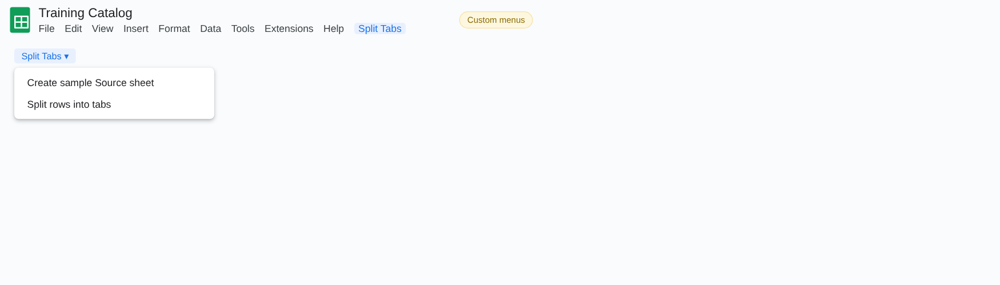
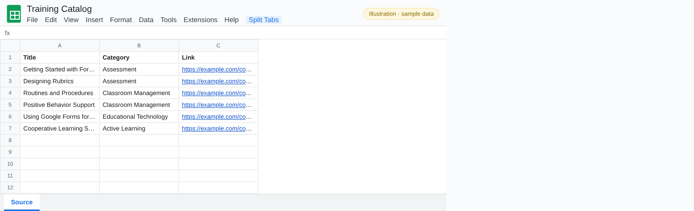
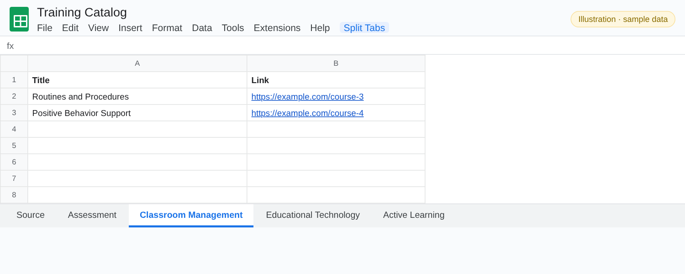
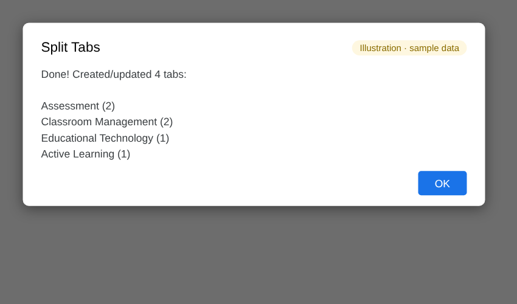
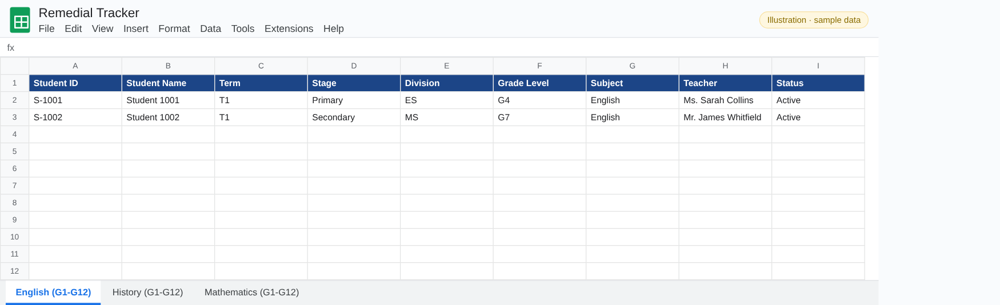
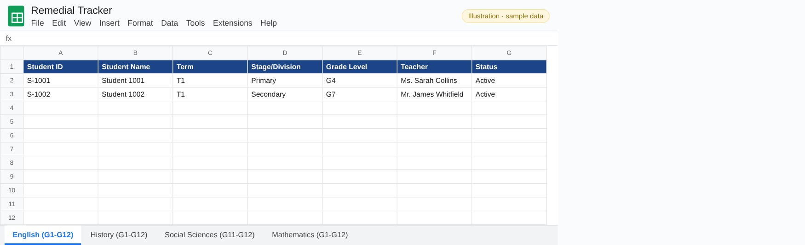
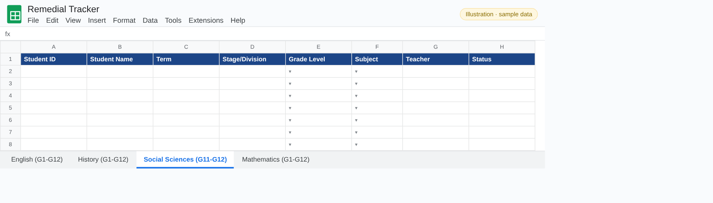

# Apps Script Snippets: illustrated guide

What each snippet does, shown step by step.

> Every picture in this guide is an **illustration filled with fictional sample data** (names like *Sarah Collins*, emails at `example.edu`). No real school, staff or student data appears anywhere in this repository.

## Contents

- [split-rows-into-tabs](#split-rows-into-tabs)
- [restructure-sheet-columns](#restructure-sheet-columns)

## split-rows-into-tabs

Groups the rows of a **Source** sheet by a category column and writes each group to its own tab.

### Split Tabs menu

| Item | What it does |
|---|---|
| **Create sample Source sheet** | Adds a Source tab with example rows so you can try the snippet straight away. |
| **Split rows into tabs** | Creates (or refreshes) one tab per category. |

### 1. The Source sheet

A title, a category and a link on each row.

### 2. Result: one tab per category

Each category tab holds just its rows. Running it again refreshes the tabs instead of duplicating them.

### 3. Summary

A message lists every tab created or updated and its row count.

## restructure-sheet-columns

A re-runnable migration for a workbook with many tabs that share one header row. Edit the `CONFIG` block, then run `restructureWorkbook()` from the editor.

### 1. Before

Every subject tab has *Stage*, *Division* and *Subject* columns.

### 2. After: columns dropped and renamed

*Division* and *Subject* are removed from every tab, and *Stage* is renamed *Stage/Division*. Tabs where a column is already gone are skipped safely.

### 3. New tab from a template

A new tab is created from the template tab and placed after a chosen tab, with an extra **Subject** column after *Grade Level* and dropdowns for the grade levels and subjects.

---

[← Back to the README](../README.md)
